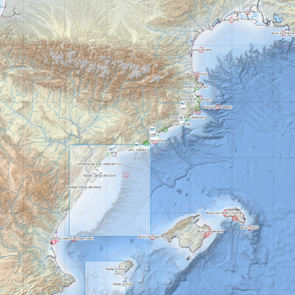

# BlueNetCat - Apps
Website for development and demonstrations of web apps for the BlueNetCat. The goal of action 4 is to capitalize the data collected by the researchers of the network. To see the status of the action, please [follow this link](https://github.com/BlueNetCat/info). The github repository can be found here: [github repository](https://github.com/BlueNetCat)

## [Network app](https://bluenetcat.github.io/network/)
Visualize all the partners of the BlueNetCat here: [network repository](https://github.com/BlueNetCat/BlueNetCat.github.io/tree/main/network)

## [Geoportal](https://bluenetcat.github.io/geoportal/index.html)
Collection of GeoJSONs that gather different oceanographic items of the Catalan coast and sea. [Geoportal repository](https://github.com/BlueNetCat/geoportal)

## [VISAP](https://bluenetcat.github.io/VISAP/)
VISAP (Servei d'Assessorament Pesquer). Application to visualize the fishing effort in the Catalan Sea. [VISAP repository](https://github.com/BlueNetCat/VISAP)

## [MARCAT](https://bluenetcat.github.io/MARCAT/)
MARCAT. Application to visualize oceanographic prediction and forecasting models. [MARCAT Repository](https://github.com/BlueNetCat/MARCAT)

## [VISAP2](https://bluenetcat.github.io/VISAP2/)
VISAP (Servei d'Assessorament Pesquer). Continuation of the first version, with the addition of climatological data and fishing effort maps. [VISAP2 repository](https://github.com/BlueNetCat/VISAP2)

## [OBSEA](https://bluenetcat.github.io/OBSEA/)
3D representation of an underwater observatory with real data of the sea. In development. [OBSEA Repository](https://github.com/BlueNetCat/OBSEA)

## Experimental
A [3D experiment with bathymetry](https://webglstudio.org/latest/player.html?url=fileserver%2Ffiles%2Fgerard%2Ftest%2Fmap.scene.json).

### Funding
This project has been financed by the "Generalitat de Catalunya" and by the European Union through the "Fons Europeu de Desenvolupament Regional" (FEDER).

